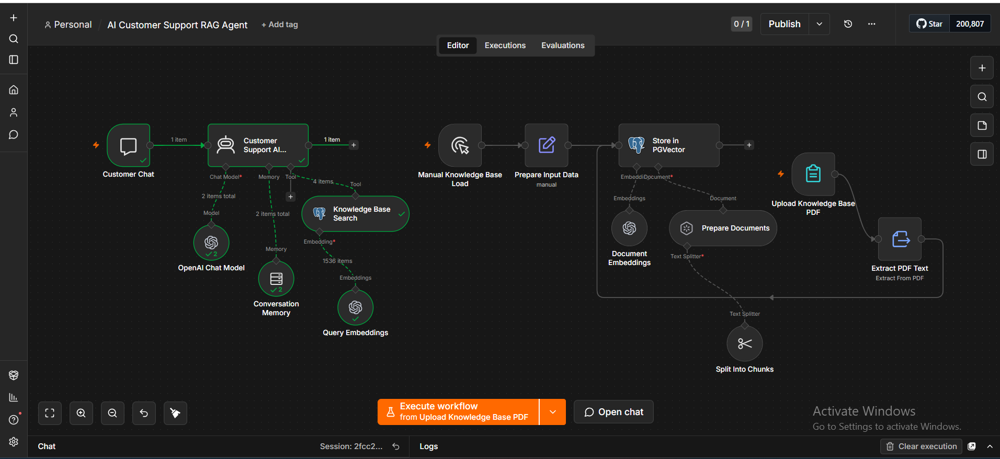
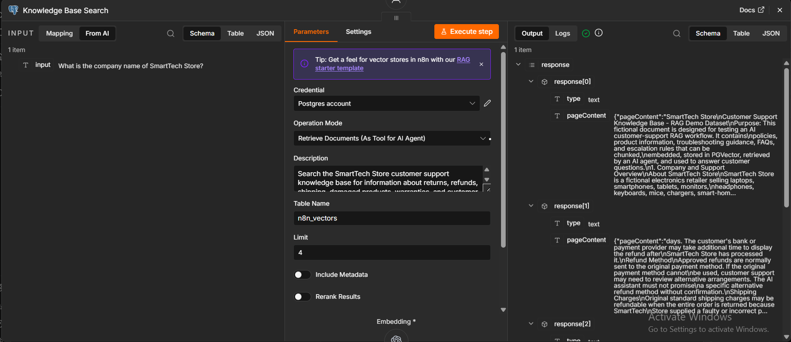
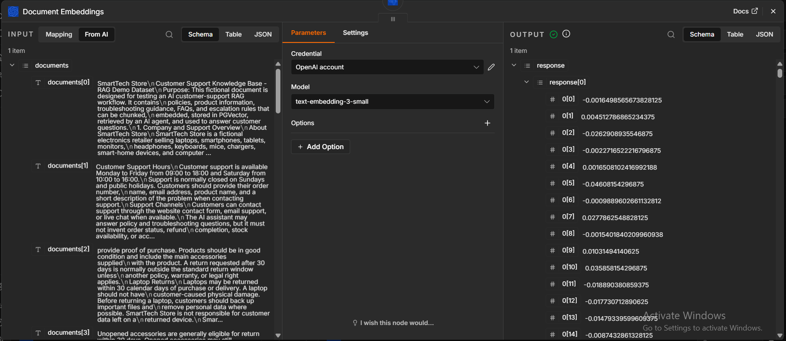
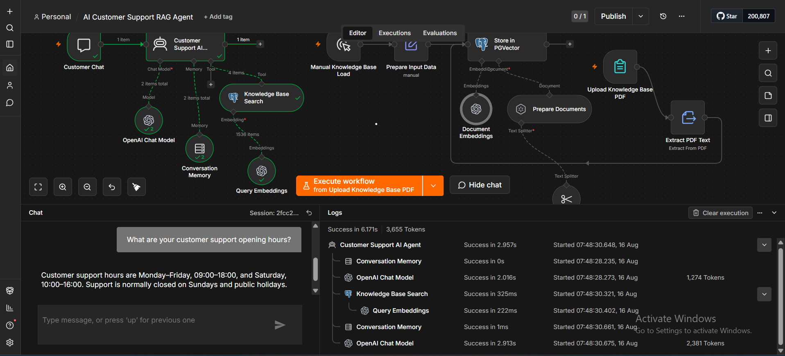
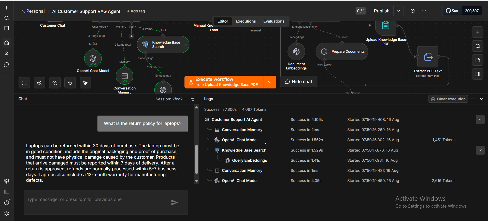
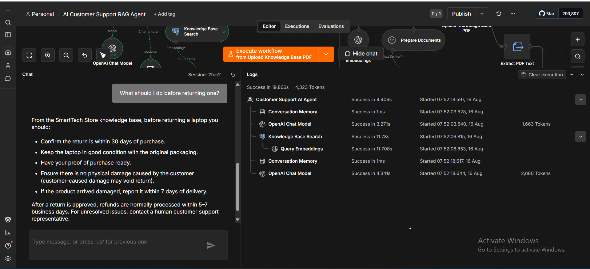

# AI Customer Support RAG Agent

An AI-powered customer support assistant built with **n8n, OpenAI, PostgreSQL/PGVector, embeddings, vector search, RAG, and conversation memory**.

The project demonstrates an end-to-end **Retrieval-Augmented Generation (RAG)** workflow where company knowledge is extracted from PDF documents, converted into embeddings, stored in a vector database, and retrieved dynamically to answer customer questions.

## 🚀 Project Overview

The goal of this project is to demonstrate how an AI customer support system can answer questions using a company's own knowledge base instead of relying only on the general knowledge of an LLM.

The system:

* Accepts a company knowledge-base PDF
* Extracts text from the document
* Splits the text into smaller chunks
* Converts the chunks into vector embeddings
* Stores the vectors in PostgreSQL using PGVector
* Converts customer questions into query embeddings
* Searches the vector database for relevant information
* Provides retrieved context to an AI agent
* Generates customer-support responses using OpenAI
* Maintains conversational context using memory

## 🏗️ Workflow Architecture

The project contains two main processes.

### 1. Knowledge Base Ingestion

```text
Knowledge Base PDF
        ↓
Extract PDF Text
        ↓
Prepare Documents
        ↓
Split Into Chunks
        ↓
OpenAI Document Embeddings
        ↓
Store in PostgreSQL / PGVector
```

### 2. Customer Support RAG

```text
Customer Question
        ↓
Customer Support AI Agent
        ↓
Knowledge Base Search
        ↓
Query Embedding
        ↓
PGVector Similarity Search
        ↓
Relevant Knowledge Base Content
        ↓
OpenAI Chat Model
        ↓
Customer Response
```

Conversation Memory is connected to the AI agent so follow-up questions can retain context from the conversation.

## 🔄 Complete n8n Workflow



The workflow combines document ingestion, embeddings, vector storage, semantic retrieval, an AI agent, and conversation memory in a single n8n automation.

## 🧠 RAG and PGVector Retrieval

The customer question is converted into an embedding and used to search the **PGVector** knowledge base.

The vector store retrieves the most relevant document chunks and provides them to the AI agent as contextual information.



In this implementation, the vector data is stored in the `n8n_vectors` table and the retrieval limit is configured to return a small number of relevant results.

## 🔢 Embeddings

The project uses OpenAI's:

`text-embedding-3-small`

model to convert knowledge-base text into numerical vector representations.



These embeddings allow the system to perform semantic search based on meaning rather than relying only on exact keyword matching.

## 💬 Customer Support Demonstration

### Customer Support Hours



### Laptop Return Policy



### Context-Aware Follow-up Question



The final example demonstrates conversational context. After discussing laptop returns, the customer asks:

> "What should I do before returning one?"

The agent uses conversation memory together with RAG retrieval to understand that the customer is referring to a laptop.

## 🛠️ Technologies Used

* **n8n** — workflow automation and AI orchestration
* **OpenAI API** — chat model and embeddings
* **PostgreSQL** — database
* **PGVector** — vector storage and similarity search
* **RAG (Retrieval-Augmented Generation)** — knowledge-grounded AI responses
* **OpenAI Embeddings** — document and query vectorization
* **Conversation Memory** — contextual multi-turn conversations
* **Docker** — local PostgreSQL/PGVector environment
* **PDF Knowledge Base** — source of company-specific information

## ✨ Key Features

* AI-powered customer support
* PDF knowledge-base ingestion
* Automated text extraction
* Document chunking
* OpenAI embeddings
* PostgreSQL/PGVector vector storage
* Semantic similarity search
* RAG-based knowledge retrieval
* AI agent orchestration
* Conversation memory
* Context-aware follow-up questions
* Reusable n8n workflow

## 📥 Import the Workflow

The complete n8n workflow is included in this repository:

`AI Customer Support RAG Agent.json`

To use it:

1. Download the JSON workflow file.
2. Open n8n.
3. Import the workflow.
4. Configure your own OpenAI credentials.
5. Configure your own PostgreSQL/PGVector credentials.
6. Make sure the PGVector database is running.
7. Upload your own knowledge-base PDF.
8. Run the knowledge-base ingestion workflow.
9. Test the customer support agent through the n8n chat interface.

## 🔐 Security

API keys, database passwords, and other sensitive credentials are **not included** in this repository.

Anyone importing the workflow must configure their own OpenAI and PostgreSQL credentials in n8n.

## 💡 What I Learned

Building this project helped me gain practical experience with:

* Retrieval-Augmented Generation (RAG)
* Embeddings and vector representations
* Vector databases
* PostgreSQL and PGVector
* Semantic search
* Document chunking
* Knowledge-base ingestion
* AI agent workflows
* Conversation memory
* OpenAI API integration
* n8n AI workflow development
* Designing an end-to-end AI automation solution

## 📌 Project Purpose

This project was built as a practical portfolio project to demonstrate skills in **AI automation, RAG systems, workflow automation, API integration, vector databases, and AI agent development**.

The SmartTech Store knowledge base used in the demonstration is fictional and was created specifically for testing this RAG workflow.

